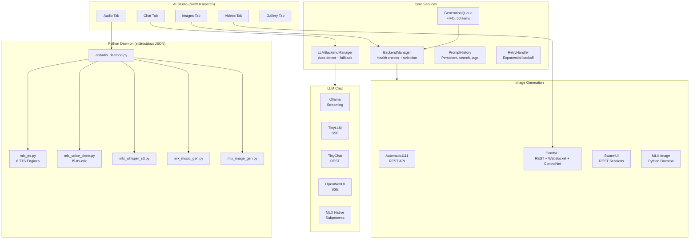

# AI Studio


**Local AI media creation studio for macOS, powered by Apple Silicon.** Generate images, videos, audio, and music -- all locally. Multi-backend image generation (Automatic1111, ComfyUI, SwarmUI, MLX), 5-backend LLM chat, a full audio suite with voice cloning, and a WidgetKit extension.

Written by Jordan Koch ([@kochj23](https://github.com/kochj23)).

---

## Architecture



`ImageBackendProtocol` abstracts all image backends behind an actor-based interface. The Python daemon communicates via stdin/stdout JSON-line protocol with UUID request IDs for concurrent requests. Modules are lazy-loaded on first use.

---

## Features

### Image Generation

| Backend | Protocol | Highlights |
|---|---|---|
| Automatic1111 | REST | txt2img and img2img |
| ComfyUI | REST + WebSocket | Workflow-based, ControlNet support |
| SwarmUI | REST | Session-based generation |
| MLX Native | Python daemon | On-device via mflux/diffusionkit |

Model picker with auto-detection per backend. SafeTensors-only enforcement (`.ckpt`, `.bin`, `.pt` blocked). Parameter controls: steps, CFG, sampler, dimensions, seed, batch size. Auto-save with date-organized output and metadata JSON export.

### Generation Queue and Prompt History

Batch up to 50 prompts with FIFO processing, pause/resume, reorder, and cancel. Persistent prompt library with search, tags, favorites, deduplication, and one-click reload.

### Image Comparison

Side-by-side mode with synchronized zoom. Slider overlay mode with draggable divider. Fit, 1:1, and zoom controls.

### Video Generation

AnimateDiff via ComfyUI with frame-to-MP4 combining (AVAssetWriter). Configurable frame count, FPS, and resolution.

### Audio Suite

- **TTS** -- 6 MLX engines via mlx-audio: Kokoro (11 voices), Dia, Chatterbox, Spark, Breeze, OuteTTS
- **Voice Cloning** -- f5-tts-mlx with auto-transcription via mlx-whisper and automatic sample rate conversion (24kHz)
- **Speech-to-Text** -- mlx-whisper (tiny through large-v3)
- **Music Generation** -- MusicGen via transformers

### LLM Chat

5 backends (Ollama, TinyLLM, TinyChat, OpenWebUI, MLX) with streaming for Ollama, TinyLLM, and OpenWebUI. Auto-detection with priority-based fallback. Conversation history, configurable system prompt, temperature, and max tokens.

### Gallery

Browse all generated media. Filter by type, search by prompt, sort by date. Metadata panel with full generation parameters. Reveal in Finder and delete.

### WidgetKit Extension

Small, medium, and large widgets with backend status and recent generation info via App Group.

### Backend Resilience

Retry with exponential backoff and jitter (3 presets: httpBackend, pythonDaemon, healthCheck). Python daemon crash recovery with auto-restart up to 5 times.

### Local API Server

Port **37425**, loopback only. `GET /api/status` and `GET /api/ping`.

---

## Installation

```bash
# From DMG (recommended) -- download from Releases
# Drag AI Studio.app to Applications

# From source
git clone git@github.com:kochj23/AIStudio.git
cd AIStudio && open AIStudio.xcodeproj
# Build and run (Cmd+R) -- Xcode 15+, macOS 14 SDK
```

Requires macOS 14.0 Sonoma and Apple Silicon. Distributed via DMG only (no Mac App Store). Sandbox disabled for file system access and Python subprocess management.

### MLX Native Setup (Optional)

```bash
python3 -m venv venv && source venv/bin/activate
pip install 'mlx-audio[kokoro]' f5-tts-mlx mlx-whisper numpy Pillow
brew install espeak-ng  # for voice cloning phonemizer
pip install mflux       # for MLX image generation
```

Set the Python path in Settings to your venv's `python3` binary.

---

## Security

- **SafeTensors-only** -- PyTorch pickle files blocked (supply chain attack vector)
- **Prompt injection prevention** -- User prompts written to temp files, not embedded as string literals
- **stdout isolation** -- ML operations redirect stdout to protect JSON protocol
- **SecureLogger** -- Redacts API keys, tokens, and PII from all log output
- **Path traversal prevention** -- Validated against `../`, symlink resolution, 4096-byte cap
- **No cloud services, no telemetry, no analytics** -- All communication is localhost

---

## Testing

205 Swift + 65 Python = 270 total tests.

### Swift (XCTest)

| Suite | Tests | Coverage |
|---|---|---|
| ComprehensiveTests | 78 | Cross-module integration, end-to-end workflows |
| ModelTests | 45 | All data models, enums, Codable, error types |
| SecurityUtilsTests | 25 | Input validation, path traversal, URL/HTML sanitization |
| SecureLoggerTests | 18 | PII redaction, API keys, JWTs, phone numbers, credit cards |
| FileOrganizerTests | 14 | Date directories, filename sanitization, metadata export |
| ImageUtilsTests | 13 | PNG/JPEG validation, base64, file size limits |
| RetryHandlerTests | 12 | Backoff, jitter, presets, cancellation |

### Python (pytest)

| Suite | Tests | Coverage |
|---|---|---|
| test_tts | 21 | Engine config, voice listing, WAV encoding |
| test_daemon | 20 | JSON protocol, request dispatch, input safety |
| test_music_gen | 7 | WAV encoding, model caching |
| test_voice_clone | 7 | WAV encoding (24kHz), resampling |
| test_image_gen | 5 | Pipeline init, model listing |
| test_whisper_stt | 5 | Model caching, standard sizes |

---

## Version History

| Version | Date | Highlights |
|---|---|---|
| 2.3.2 | Mar 2026 | Prompt injection fix, SafeTensors enforcement, URLComponents safety |
| 2.3.1 | Feb 2026 | Daemon pipe buffering fix, voice cloning auto-transcription, TTS rewrite for mlx-audio 0.3.x |
| 2.3.0 | Feb 2026 | Queue, prompt history, image comparison, ControlNet, LLM streaming, retry/backoff |
| 2.2.0 | Feb 2026 | WidgetKit extension |
| 2.1.0 | Feb 2026 | LLM chat with 5 backends |
| 2.0.0 | Feb 2026 | Complete rewrite: audio suite, video, gallery, multi-backend |
| 1.0.0 | Feb 2026 | Initial release with Automatic1111 |

---

## License

MIT License -- see [LICENSE](./LICENSE).

Copyright (c) 2026 Jordan Koch. All rights reserved.

---

Written by Jordan Koch ([@kochj23](https://github.com/kochj23)).

> Disclaimer: This is a personal project created on my own time. It is not affiliated with, endorsed by, or representative of my employer.
